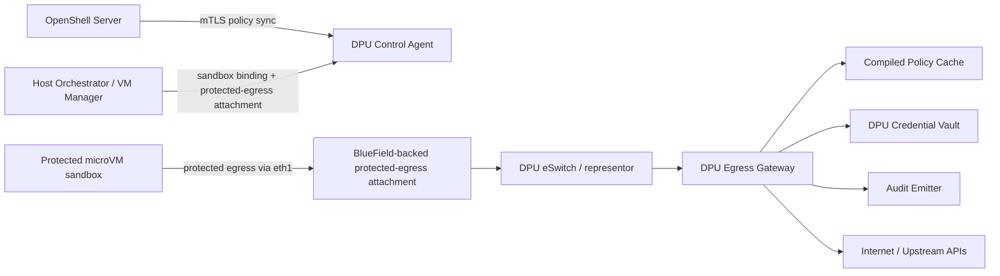
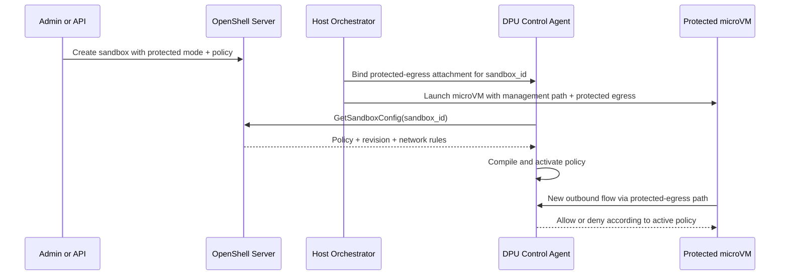

# Design Spec: OpenShell x BlueField-3 MVP

Status: Draft  
Last updated: 2026-04-10  
Primary audience: Systems engineers, platform engineers, security engineers

## 1. Overview

This document turns the OpenShell x BlueField-3 concept into an implementable MVP. The central design choice is simple:

- OpenShell remains the policy source of truth.
- BlueField becomes the mandatory outbound path for protected sandboxes.
- Protected sandboxes run in a microVM-backed runtime by default.
- The DPU enforces policy and emits audit from a trust boundary stronger than the host.

The MVP optimizes for credible enforcement, clear trust boundaries, and operational simplicity over maximum feature breadth.

## 2. Design constraints

Three constraints shape the design:

### Constraint A: transparent TLS modification is not free

The DPU cannot safely inject HTTP headers into arbitrary HTTPS traffic unless one of the following is true:

- the sandbox uses explicit proxy mode, or
- the sandbox trusts a DPU-managed CA and allows TLS interception.

Because of this, the MVP separates:

- direct enforcement mode for destination control and audit, and
- managed-provider proxy mode for routes that need DPU-side credentials.

### Constraint B: host-supplied binary metadata is not strong identity

If a root attacker on the host can choose the metadata sent to the DPU, then binary identity is advisory, not trustworthy. For the MVP:

- binary identity is accepted only as an optional audit hint,
- policy enforcement does not depend on host-asserted binary metadata,
- strong binary identity is deferred to a future attestation-based design.

### Constraint C: FQDN policies need connection metadata

Many OpenShell policies are destination-host based. The DPU therefore needs access to destination metadata at connection setup time through one or more of:

- SNI for TLS,
- Host headers for HTTP,
- managed DNS resolution and cache state,
- explicit proxy CONNECT metadata.

IP-only enforcement is not sufficient for many SaaS APIs.

## 3. Goals

### MVP goals

1. Force protected sandbox egress through the DPU.
2. Enforce deny-by-default outbound policy based on OpenShell policy data.
3. Keep managed provider secrets on the DPU only.
4. Provide policy hot reload and DPU-originated audit.
5. Support a clean operator rollout path.

### Deferred goals

1. Strong binary identity under hostile host assumptions.
2. Generic TLS MITM for all traffic.
3. DPU-backed shared storage or model-weight mounts.
4. Full hardware offload of all policy types.
5. Multiple host-runtime adapters beyond the microVM-first MVP.

## 4. Proposed architecture



### High-level model

- Each protected sandbox runs in a microVM-backed runtime with a management path and a protected-egress attachment.
- The DPU maps protected-egress identity to sandbox identity and current compiled policy.
- All protected outbound traffic from that attachment is steered through a DPU egress gateway.
- The gateway enforces destination policy and optionally handles managed-provider proxy flows.
- The DPU emits audit events and health state independently of the host.

## 5. Component responsibilities

### 5.1 OpenShell server

Responsibilities:

- source of truth for sandbox policy and revisions,
- serves `GetSandboxConfig` or equivalent mTLS-protected policy API,
- stores operator-defined policy groups and sandbox attachments,
- ingests or receives mirrored audit events.

No change in product role is required. The main requirement is a stable policy contract for the DPU.

### 5.2 Host orchestrator

Responsibilities:

- request protected mode for a sandbox,
- launch the microVM-backed sandbox runtime,
- attach the management path and protected-egress attachment,
- register sandbox-to-egress binding with the DPU control plane,
- surface sandbox protection state locally.

The host orchestrator is operationally trusted to request protected mode, but the security design does not trust it to enforce policy.

### 5.3 DPU control agent

Responsibilities:

- authenticate to OpenShell over mTLS,
- fetch sandbox policy and revisions,
- track sandbox-to-protected-egress bindings,
- compile policy into a DPU-friendly form,
- publish active policy to the egress gateway,
- manage last-known-good policy and TTL behavior,
- expose health and status.

Implementation note:

- Rust is a good default choice because the existing proxy work is already Rust-oriented and the control/data-plane boundary is sensitive.

### 5.4 DPU egress gateway

Responsibilities:

- receive all outbound flows from protected-egress attachments,
- classify flows by sandbox binding and destination metadata,
- enforce allow or deny decisions,
- proxy managed-provider routes when credential injection is required,
- emit allow and deny audit events,
- fail closed if active policy is unavailable or expired.

The egress gateway may start in software on the DPU ARM while still preserving the key property that the host cannot bypass the path.

### 5.5 DPU credential vault

Responsibilities:

- store provider secrets, client certs, and upstream auth material,
- expose only named secret references to the egress gateway,
- support rotation without host distribution,
- keep audit logs of secret updates and route usage.

### 5.6 Audit emitter

Responsibilities:

- emit OCSF-like JSON events or the closest OpenShell-compatible schema,
- include sandbox ID, protected-egress ID, destination, decision, policy revision, and reason,
- buffer locally if the central sink is temporarily unavailable.

## 6. Trust boundaries

### Trusted boundary for MVP

- BlueField DPU OS and software stack, assuming secure boot or equivalent deployment hardening
- OpenShell server policy API and mTLS identities

### Explicitly not trusted for enforcement

- host OS,
- host proxy processes,
- host local filesystem,
- host-observed process metadata.

### Important deployment assumptions

- Protected sandbox traffic cannot reach the uplink except through the DPU path.
- PF ownership and switch configuration must not be left fully mutable to the host in deployed protected mode.
- IOMMU and SR-IOV isolation must be correctly configured.
- The protected microVM runtime must not rely on host userspace networking for the protected-egress path.

These assumptions should be validated during pilot deployment rather than treated as implicit truths.

## 7. Policy model

The DPU should consume OpenShell policy but compile it into a narrower runtime format optimized for enforcement.

### 7.1 Proposed compiled policy shape

```json
{
  "sandbox_id": "quick-mara",
  "policy_revision": "sha256:...",
  "vf_id": "pf0vf3",
  "default_action": "deny",
  "policy_ttl_seconds": 300,
  "rules": [
    {
      "rule_id": "anthropic-api",
      "match": {
        "protocol": "tcp",
        "port": 443,
        "host_pattern": "api.anthropic.com"
      },
      "mode": "direct",
      "l7": null,
      "credential_ref": null
    },
    {
      "rule_id": "nim-managed-route",
      "match": {
        "protocol": "tcp",
        "port": 443,
        "host_pattern": "integrate.api.nvidia.com"
      },
      "mode": "managed_proxy",
      "l7": {
        "methods": ["POST"],
        "paths": ["/v1/chat/completions"]
      },
      "credential_ref": "nvidia-nim-prod"
    }
  ],
  "binary_identity_mode": "disabled"
}
```

### 7.2 Modes

- `direct`: DPU allows or denies the connection and forwards without credential injection.
- `managed_proxy`: DPU terminates or proxies according to an explicit trust model and can inject credentials from the vault.

### 7.3 Binary identity field

For the MVP, `binary_identity_mode` should default to `disabled` or `advisory`. It should not be used as a hard security dependency until the project introduces attested launch or signed execution tokens.

## 8. Data plane behavior

### 8.1 Direct mode

Used for:

- coarse outbound allow or deny,
- destinations that do not require DPU-side secrets,
- pilot flows where transparent egress is preferred.

Decision sources:

- sandbox ID from protected-egress binding,
- destination metadata from connection setup,
- compiled allowlist and deny-by-default rule.

Behavior:

1. Traffic exits the microVM through its protected-egress interface rather than the management path.
2. The DPU representor steers the flow to the egress gateway.
3. The gateway determines destination host metadata using explicit proxy metadata, SNI, Host header, or DNS cache state.
4. If the flow matches an allow rule, it is forwarded.
5. If the flow does not match an allow rule, it is denied and audited.

### 8.2 Managed-provider proxy mode

Used for:

- provider APIs that require DPU-resident credentials,
- routes where method or path rules matter,
- cases where the sandbox is configured for explicit proxy mode or trusts a DPU-managed CA.

Behavior:

1. The DPU identifies a flow as requiring managed proxy handling.
2. The proxy terminates or explicitly proxies the connection according to the configured trust model.
3. The proxy injects credentials referenced by `credential_ref`.
4. The proxy enforces optional method and path rules.
5. The request is forwarded upstream and audited.

MVP note:

- This mode should be opt-in and limited to supported providers rather than advertised as a universal transparent interception layer.

## 9. Control plane behavior

### 9.1 Sandbox provisioning sequence



### 9.2 Policy update behavior

1. DPU polls or subscribes to OpenShell policy changes.
2. If the policy hash changed, the DPU recompiles and swaps the active policy atomically.
3. The DPU emits a policy update audit event with old and new revision identifiers.
4. Existing flows may continue or be drained according to connection policy; new flows always use the new revision.

### 9.3 Failure behavior

- If policy refresh fails but the last-known-good policy is still within TTL, the DPU keeps enforcing it and marks the sandbox `degraded`.
- If TTL expires, the DPU blocks new flows and marks the sandbox `fail_closed`.
- If the audit sink is unavailable, the DPU buffers events locally up to a configured limit and surfaces backpressure in health state.

## 10. Network enforcement strategy

The architecture should separate "on-path" from "offloaded."

### MVP strategy

- All protected traffic is on-path through the DPU.
- Policy decisions are made by DPU software using a compiled policy cache.
- Basic allow or deny flows are forwarded directly.
- Managed-provider routes go through the proxy path.

### Later optimization

- Compile simple, stable L3/L4 rules to OVS or TC flower for hardware offload.
- Keep L7-sensitive flows in the software gateway.

This sequencing lets the team prove the trust model first and optimize throughput second.

## 11. Threat model

| Threat | In scope | Mitigation | Residual risk |
| --- | --- | --- | --- |
| Host root disables host proxy | Yes | Host proxy is no longer the enforcement point | None if DPU remains on-path |
| Host root reads host disk for provider keys | Yes | Secrets live only on DPU for managed routes | Secrets used directly inside sandbox remain out of scope |
| Sandbox process attempts unauthorized egress | Yes | Deny-by-default DPU enforcement | Destination classification gaps must be tested carefully |
| Host spoofs binary path metadata | Yes | Binary identity not trusted for MVP enforcement | Binary-specific policy must wait for attestation |
| DPU policy API unavailable | Yes | Last-known-good + TTL + fail closed | Short outages may temporarily preserve stale allow rules |
| DPU OS compromise | No for MVP | Deployment hardening, secure boot, access controls | Stronger hardware root-of-trust work may be needed |
| PF or SR-IOV host reconfiguration | Partially | Deployment prerequisite and operational monitoring | Some environments may not qualify for protected mode |

## 12. Observability and audit

Minimum audit fields:

- timestamp,
- sandbox_id,
- protected_egress_id,
- decision,
- destination_host,
- destination_ip,
- destination_port,
- policy_rule_id,
- policy_revision,
- mode (`direct` or `managed_proxy`),
- reason,
- bytes_sent and bytes_received when available.

Minimum health fields:

- sandbox protection state,
- active policy revision,
- last policy sync time,
- policy source reachability,
- credential vault health,
- audit backlog depth.

## 13. API and interface sketch

### 13.1 OpenShell to DPU

Reuse existing policy API where possible:

- `GetSandboxConfig(sandbox_id)`

Expected fields needed by the DPU:

- sandbox ID,
- policy revision or hash,
- outbound network rules,
- L7 method or path constraints for supported routes,
- optional secret route references,
- sandbox protection mode.

### 13.2 Host to DPU

Internal API surface:

- `AllocateOrBindProtectedEgress(sandbox_id)`
- `ReleaseProtectedEgress(sandbox_id)`
- `ReportSandboxLifecycle(sandbox_id, state)`
- `GetProtectionStatus(sandbox_id)`

### 13.3 DPU internal contracts

- compiled policy store
- credential vault interface
- audit event interface
- flow classification interface

These contracts should be explicitly versioned early so agent-generated code does not drift.

## 14. Security decisions

1. The DPU is the enforcement point for protected mode.
2. Protected mode is deny by default.
3. Last-known-good policy is bounded by TTL and never indefinite.
4. Managed-provider credential injection is opt-in and route-specific.
5. Binary identity is not a release blocker for MVP.
6. Audit must originate from the DPU path, not only from the host.
7. Deployment prerequisites must include DPU ownership and SR-IOV isolation checks.

## 15. Rollout plan

### Phase 0: simulated path

- Use host processes and mock bindings to validate compiled policy format and audit model.
- Exercise the DPU control agent without requiring full protected-egress integration.

### Phase 1: protected egress pilot

- One protected microVM sandbox on one host
- Protected-egress attachment working
- DPU direct-mode enforcement working
- Audit and fail-closed behavior verified

### Phase 2: managed-provider routes

- One or two explicit provider integrations
- DPU-resident secret rotation
- Method and path enforcement for proxied routes

### Phase 3: optimization and hardening

- selective hardware offload,
- stronger deployment checks,
- optional attestation work for binary identity.

## 16. Test strategy

### Unit tests

- policy compilation,
- rule matching,
- TTL and fail-closed logic,
- audit serialization,
- credential route selection.

### Integration tests

- mock OpenShell server to DPU policy sync,
- sandbox-to-protected-egress binding lifecycle,
- microVM boot and dual-path network setup,
- allow and deny behavior for direct mode,
- managed-provider proxy flow with secret injection,
- policy update while traffic is active.

### Hardware-in-loop tests

- BlueField protected-egress provisioning,
- representor steering,
- host compromise simulation where host proxy is disabled,
- DPU restart and recovery behavior.

### Adversarial tests

- stale policy replay,
- malformed metadata,
- unauthorized destination attempts,
- audit sink outage,
- repeated secret rotation.

## 17. Open questions

1. Can the preferred microVM runtime expose a second network interface suitable for the protected-egress path?
2. Can that second interface be VF-backed in the initial MVP without collapsing into host userspace networking?
3. What exact BlueField deployment mode best preserves DPU ownership while fitting the current host environment?
4. Do we control DNS for protected sandboxes, or do we rely on SNI and explicit proxy metadata first?
5. What trust-bundle distribution method is acceptable for managed-provider proxy mode?
6. What policy subset is required for pilot customers versus later releases?

## 18. Recommended first implementation slice

The best first end-to-end slice is:

1. one sandbox,
2. one protected-egress attachment,
3. one allowlisted destination,
4. one deny case,
5. policy sync from OpenShell,
6. audit on allow and deny,
7. fail-closed after TTL expiry.

If that path works, the platform has already proven the core value proposition: policy survives beyond the host.
