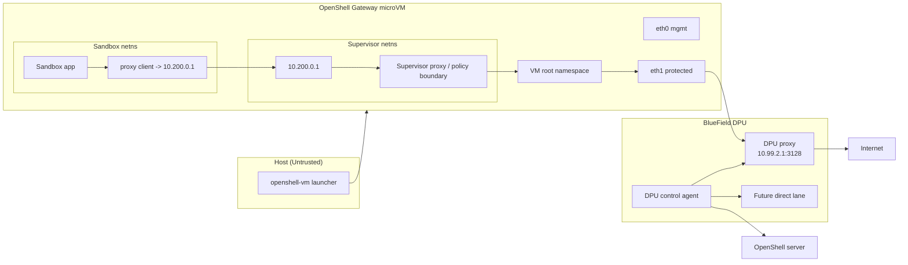

# DPU Managed Proxy Architecture: Supervisor Upstream Model

This is the corrected `managed_proxy` architecture for OpenShell on BF3.

The key design correction is:

- the sandbox should **not** talk directly to the DPU proxy
- the existing **per-sandbox supervisor proxy** remains the sandbox's first-hop proxy
- the supervisor uses the VM's protected path (`eth1`) to reach the DPU proxy as its **upstream**

## Decision

For the `managed_proxy` MVP:

- keep the existing sandbox-to-supervisor proxy model
- keep one protected NIC on the VM: `eth1`
- do **not** add another sandbox interface
- make the supervisor proxy send selected outbound traffic to the DPU proxy over `eth1`

This preserves OpenShell's current trust and process model while moving protected egress enforcement onto the DPU.

## Why This Is The Right Design

OpenShell today already has:

- a per-sandbox supervisor
- a per-sandbox local proxy endpoint
- per-sandbox policy semantics
- process/binary identity at the supervisor boundary

Trying to make the sandbox talk directly to `10.99.2.1:3128` bypasses the wrong layer and forces unnatural routing changes across:

- sandbox netns
- supervisor netns
- VM root netns

The supervisor is the correct integration point.

## Components And Interfaces

### Host

- `openshell-vm` runs the OpenShell gateway microVM
- host is untrusted for DPU control
- host only launches and manages the VM lifecycle

### VM

- `eth0`
  - management / gvproxy / control-plane traffic for the VM
- `eth1`
  - protected egress path toward the DPU
  - backed by VF bridge and BF3 OVS wiring

### Per-sandbox runtime inside the VM

- sandbox netns
  - app process
  - proxy client config points to `10.200.0.1`
- supervisor netns
  - owns `10.200.0.1`
  - runs or fronts the existing OpenShell proxy logic
  - becomes the **upstream client** of the DPU proxy for protected destinations

### DPU

- shared DPU control agent
  - pulls policy from OpenShell over a DPU-owned control path
  - materializes DPU-local runtime state
- DPU proxy service
  - receives upstream proxy traffic from the supervisor over the protected path
  - applies DPU-local policy and credentials
  - forwards to internet

## High-Level Component Diagram

## Interface-Level Flow

## Request Path For `managed_proxy`

1. The sandbox app makes an outbound request through its existing proxy configuration.
2. The request lands on the per-sandbox supervisor gateway at `10.200.0.1`.
3. The supervisor evaluates local policy and decides the route mode.
4. For `managed_proxy`, the supervisor opens an upstream proxy connection to the DPU proxy.
5. That upstream connection leaves the VM over the protected path on `eth1`.
6. The DPU proxy applies DPU-local policy, credentials, and audit.
7. The DPU proxy forwards the request to the external destination.

## What Changes In Code

### Keep unchanged

- sandboxs still target the local supervisor proxy
- sandbox netns layout
- per-sandbox supervisor model
- DPU control-agent concept
- protected `eth1` BF3 path

### Change

- supervisor proxy gains an **upstream DPU proxy mode**
- supervisor netns gets explicit routing for DPU protected proxy destinations
- DPU proxy becomes the supervisor's upstream for protected routes

## MVP And Later Phases

### MVP: `managed_proxy`

- sandbox -> supervisor proxy remains unchanged
- supervisor -> DPU proxy over `eth1`
- DPU proxy is shared first
- per-sandbox identity is carried at the supervisor layer, not inferred from source IP alone

### Later: `direct`

- separate lane
- likely DOCA-native
- no requirement to preserve the supervisor proxy hop

### Later: stronger isolation

- per-sandbox VF
- per-sandbox DPU proxy container
- possibly per-sandbox DPU VM

These are useful future hardening steps, but they are not required for the first working `managed_proxy` slice.

## Why We Do Not Add Another Sandbox Interface

For the `managed_proxy` MVP, adding another sandbox NIC is the wrong abstraction.

It would:

- bypass the supervisor, which already owns proxy semantics today
- make sandbox routing more complex
- duplicate policy handoff work
- weaken the fit with current OpenShell behavior

One protected VM interface (`eth1`) is enough. The supervisor should be the component that uses it.

## Non-goals

- no direct sandbox -> DPU proxy first-hop model for MVP
- no more netns-specific ad hoc routing hacks as the product design
- no transparent NAT path for `managed_proxy`
- no Comm Channel dependency for MVP

## Recommended Next Implementation Step

Implement **supervisor upstream proxying to the DPU proxy**.

Concretely:

1. add upstream DPU proxy support to the supervisor proxy
2. add supervisor-netns routing to the DPU protected subnet
3. authenticate supervisor -> DPU proxy per sandbox
4. keep sandbox-side behavior unchanged

