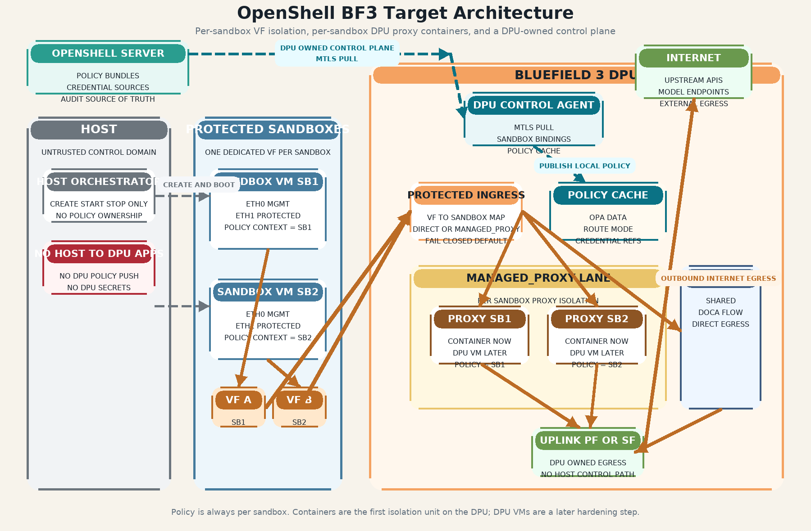

# OpenShell BF3 VF-Isolated Architecture

This note captures the recommended BF3 target architecture that stays closest to how OpenShell works today:

- policy stays **per sandbox**
- each protected sandbox gets a **dedicated VF**
- `managed_proxy` uses a **per-sandbox DPU proxy container**
- `direct` uses a **shared DPU-native direct lane**
- the **DPU control agent** owns policy and credential pull
- the **host stays untrusted** and does not push DPU policy or secrets

## Rendered Diagram

Source artifacts:

- [vf-isolated-dpu-architecture.svg](./vf-isolated-dpu-architecture.svg)
- [render-vf-isolated-dpu-architecture.py](./render-vf-isolated-dpu-architecture.py)

## Design Summary

### Trust boundaries

- The host launches sandboxes but is not the control-plane authority for DPU services.
- The guest uses `eth1` for protected egress and reaches the DPU over its dedicated VF.
- The DPU control agent pulls policy and credential references from OpenShell over a DPU-owned control path.
- The protected guest does not provision DPU policy or secrets.

### Managed proxy lane

- One DPU proxy isolation unit per sandbox.
- Container first, DPU VM later if stronger isolation is needed.
- The DPU control agent maps `VF -> sandbox_id`, then publishes sandbox-specific policy and credential references into the correct proxy unit.

### Direct lane

- Shared DPU-native dataplane for `direct` routes.
- Intended future implementation is DOCA Flow based, not OVS CT/NAT or Linux netfilter NAT.
- Steering remains policy-driven and still keyed by sandbox identity.

## Recommended first implementation

1. Keep one dedicated protected VF per sandbox.
2. Run one proxy container per sandbox on the DPU.
3. Run one shared DPU control agent that:
   - pulls policy from OpenShell
   - owns the sandbox binding map
   - publishes per-sandbox config into the proxy containers
4. Add the direct lane after the proxy path is proven.

## Non-goals

- No host-to-DPU application control path.
- No guest-mediated policy or credential provisioning.
- No more investment in OVS CT/NAT or Linux `iptables` / `nftables` NAT for this BF3 protected-egress path.
