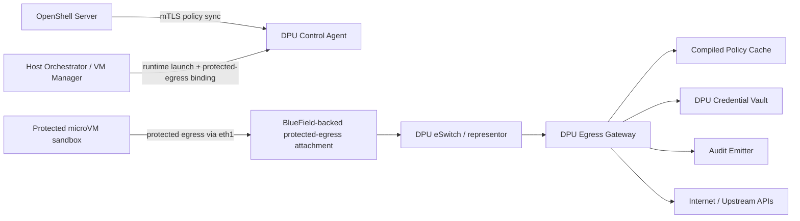

# OpenShell x BlueField-3

## Hardware-Enforced Secure Runtime for AI Coding Agents

Status: Draft  
Version: 2.1  
Last updated: 2026-04-10  
Audience: Product, platform engineering, security engineering, systems engineering

Optional codename: Project Aegis

## 1. Executive summary

AI coding agents such as Codex, Claude Code, Cursor, and Copilot act like privileged operators: they execute arbitrary code, call external APIs, access source repositories, and often hold high-value credentials. Today, most agent security is enforced by software running on the host OS. If the host is compromised, the enforcement layer is at risk too.

OpenShell x BlueField-3 moves the trust boundary away from the host and onto the DPU. OpenShell remains the control plane and policy source of truth. BlueField-3 becomes the mandatory outbound enforcement path for protected sandboxes. In protected mode, outbound policy, managed-route credentials, and audit decisions are enforced from the DPU path rather than from host-side software.

The MVP goal is not to solve every hard problem on day one. It is to deliver a credible first release that:

- runs protected sandboxes in a microVM-backed runtime,
- forces protected sandbox egress through the DPU,
- enforces deny-by-default outbound policy using OpenShell policy data,
- stores provider credentials on the DPU for supported managed routes,
- emits audit events from the DPU-side enforcement path,
- and fails closed when current policy cannot be validated or enforced.

## 2. Problem statement

AI agents are unusually risky workloads because they:

- execute untrusted or semi-trusted code,
- make arbitrary outbound network calls,
- interact with sensitive repositories and external APIs,
- use credentials that may have direct financial or data-access consequences,
- and usually run on general-purpose hosts that are exposed to supply-chain, dependency, and privilege-escalation risk.

In the common host-proxy model, a compromised host can:

- disable or bypass the proxy,
- read secrets stored on local disk,
- tamper with process metadata,
- redirect traffic before it is evaluated,
- and produce audit logs that no longer reflect a trustworthy control point.

This means the host is both the most attacked layer and the layer that current agent security asks users to trust the most.

## 3. Product thesis

OpenShell defines what an agent is allowed to do. BlueField-3 ensures protected sandboxes cannot do anything else without passing through a stronger trust boundary than the host OS.

The combined value proposition is:

- centralized policy,
- hardware-separated enforcement,
- DPU-resident managed secrets,
- tamper-resistant audit,
- and a clear fail-closed model for protected agent egress.

## 4. Users and personas

### Primary users

- Platform security engineers who define and enforce policy for agent workloads
- AI infrastructure engineers who operate OpenShell sandboxes and provider integrations
- Security operations and compliance teams who need trustworthy audit and incident evidence

### Secondary users

- Internal AI platform teams providing secure agent infrastructure to developers
- Enterprise buyers evaluating controls for sensitive or regulated deployments

## 5. Jobs to be done

- As a security engineer, I need protected agent sandboxes to lose outbound access when policy enforcement is stale or unavailable rather than quietly failing open.
- As an AI infrastructure engineer, I need to attach policy once and have enforcement update without restarts.
- As an operator, I need provider credentials for managed routes to stay off the host filesystem.
- As a compliance owner, I need audit events from the enforcement boundary, not just from host software.
- As an application team, I need secure protected egress without forcing every agent framework to implement its own network controls.

## 6. Goals

### MVP goals

1. Deliver hardware-separated outbound enforcement for protected OpenShell sandboxes.
2. Reuse OpenShell as the policy source of truth instead of creating a second policy language.
3. Use a microVM-backed runtime for protected mode so agent sandboxes do not share the host kernel directly.
4. Make protected mode deny by default and fail closed on policy expiry or enforcement failure.
5. Support DPU-resident secrets for managed upstream routes.
6. Emit structured audit events from the DPU path.
7. Prove the architecture on a small pilot footprint and scale later without redesign.

### Non-goals for MVP

1. Universal transparent TLS interception for arbitrary HTTPS traffic.
2. Host-compromise-proof binary identity enforcement.
3. DPU-backed shared storage, secret mounts, or policy-gated model-weight access.
4. Full hardware offload of all L3-L7 decisions.
5. Inbound or east-west service protection beyond protected sandbox egress.
6. Broad multi-cluster fleet orchestration or tenant billing.
7. Multiple runtime adapters in the first release; Kubernetes and OpenShift integrations can follow the microVM-backed MVP.

## 7. Product principles

- Security claims must match the actual trust boundary.
- Protected mode fails closed rather than silently falling back to weaker enforcement.
- Central policy, local enforcement.
- The first release should prove the trust model before optimizing for breadth.
- Features that require trust-bundle changes or runtime cooperation must be explicit, not implied.

## 8. Core capabilities

### 8.1 Protected egress mode

Each protected sandbox runs in a microVM-backed runtime. The preferred MVP model is dual-homed:

- `eth0`: management and control path
- `eth1`: protected egress path

Outbound traffic that needs DPU enforcement is forced through the protected-egress path before it reaches the uplink.

The protected-egress path should be backed by a BlueField-visible attachment such as a VF-backed interface or another DPU-owned ingress path that preserves the hardware trust boundary. Management traffic can continue to use a conventional host-mediated path.

Preferred MVP runtime:

- a libkrun/KVM-backed microVM or equivalent lightweight VM runtime

Follow-on runtime adapters:

- KubeVirt or OpenShift Virtualization
- OpenShift Sandboxed Containers or other VM-backed pod runtimes

Important implementation constraint:

- The protected-egress path must not collapse back into the host userspace networking path. `gvproxy` or equivalent host networking is acceptable for `eth0`, but not sufficient for `eth1`.

### 8.2 DPU policy sync

The DPU fetches sandbox policy from OpenShell over mTLS, compiles it into a narrower enforcement format, and swaps it live when policy revisions change.

The enforcement hot path should use compiled in-memory policy structures rather than making an OPA REST call per new connection. OPA can still be used as a policy authoring, validation, or translation layer, but the DPU data plane should evaluate a compiled allow or deny structure locally.

### 8.3 DPU-originated audit

Allow, deny, policy sync, policy failure, and protection-state events are emitted from the DPU-side enforcement path and can be exported centrally.

### 8.4 Managed-provider proxy mode

For supported routes that require DPU-resident credentials, the DPU can proxy the request using an explicit trust model. This is separate from direct protected egress.

## 9. What the MVP will and will not claim

### Claims we can make

- Protected sandbox egress is forced through the DPU path when deployment prerequisites hold.
- Deny-by-default policy is enforced on the DPU for protected sandboxes.
- Managed-route credentials can reside on the DPU rather than on the host.
- Policy changes can propagate without sandbox restart.
- Protected mode can fail closed for new flows when policy becomes stale or enforcement becomes unavailable.

### Claims we will not make for MVP

- That binary identity is strong under full host compromise.
- That arbitrary HTTPS traffic can always be transparently intercepted and modified without client trust changes.
- That all traffic classes are hardware-offloaded at line rate.
- That every sandbox secret or data path is DPU-resident by default.

## 10. High-level architecture



## 11. Trust boundaries

### Trusted for MVP

- the BlueField DPU software stack, subject to deployment hardening,
- the OpenShell control plane and policy API,
- the mTLS identities used for policy sync and control communication.

### Not trusted for enforcement

- the host OS,
- host proxy processes,
- host local disk,
- host-observed process metadata,
- host-side audit as the only source of truth.

### Deployment assumptions

- protected sandbox traffic cannot reach the uplink except through the DPU path,
- PF ownership and switch configuration are deployment-controlled,
- SR-IOV and IOMMU isolation are configured correctly,
- DPU management access is separately controlled and hardened.

## 12. Data-plane model

The MVP separates two paths.

### 12.1 Direct mode

Used for:

- destination allow or deny decisions,
- transparent protected egress,
- routes that do not need DPU-side credential injection.

Behavior:

1. The sandbox sends traffic through its assigned VF.
2. The DPU representor steers the flow to the egress gateway.
3. The gateway maps the VF to the sandbox identity and active policy.
4. Destination metadata is derived from connection context such as SNI, Host header, explicit proxy metadata, or managed DNS state.
5. Matching allow rules are forwarded.
6. Non-matching flows are denied and audited.

Recommended pilot approach:

- treat DNS-derived hostname-to-IP mappings as one classification signal,
- combine them with SNI or explicit proxy metadata when available,
- and fail conservatively when destination identity cannot be established with enough confidence.

Recommended steering decision for the pilot:

- use a transparent interception path that preserves the original destination tuple for the DPU software gateway,
- prefer a TPROXY-style design for software-handled flows so direct mode, managed-proxy mode, audit, and policy matching share the same destination view,
- and defer TC eBPF or alternate redirect mechanisms unless the pilot proves TPROXY insufficient.

### 12.2 Managed-provider proxy mode

Used for:

- supported routes that require DPU-resident credentials,
- provider-specific L7 method or path enforcement,
- cases where the trust model explicitly permits proxy handling.

Behavior:

1. The DPU identifies a route requiring managed proxy handling.
2. The proxy handles the request according to the configured trust model.
3. Credentials are retrieved by reference from the DPU vault.
4. Optional method and path rules are enforced.
5. The request is forwarded upstream and audited.

Important:

- This mode is opt-in.
- It is not the same thing as universal transparent MITM.
- If request termination or header injection is required, the client trust model must be explicit, including any required trust-bundle distribution or explicit proxy configuration.

## 13. Control-plane model

### Provisioning flow

1. An operator creates or updates a sandbox in OpenShell with protected mode enabled.
2. The host orchestrator launches a protected microVM for that sandbox.
3. The host attaches a management path and a protected-egress attachment.
4. The DPU fetches policy using the sandbox identity.
5. The DPU compiles and activates the policy.
6. New flows are enforced against the active revision.

### Policy update flow

1. The DPU maintains an mTLS control-plane session to OpenShell and periodically sends a heartbeat that includes sandbox identity, active policy revision or hash, and lightweight health or telemetry state.
2. Policy responses include a bounded validity window such as TTL or `valid_until`.
3. If the revision or hash changed, the DPU recompiles the policy.
4. The active policy is swapped atomically.
5. New flows use the new revision immediately.
6. The change is audited.

Suggested pilot defaults:

- heartbeat interval: 30 seconds,
- policy validity window: 300 seconds unless the control plane specifies otherwise.

### Failure handling

- If policy refresh fails but the last-known-good policy is still within its validity window, enforcement continues and the sandbox is marked `degraded`.
- If the validity window expires, the DPU blocks new flows and marks the sandbox `fail_closed`.
- If the audit sink is unavailable, the DPU buffers locally and surfaces health degradation.
- Fail-closed behavior must be implemented with explicit default-drop and health-gated steering rules on the DPU path; it is not an automatic property of VF usage alone.

## 14. Policy model

The DPU consumes OpenShell policy but enforces a compiled form optimized for runtime decisions.

Example conceptual shape:

```json
{
  "sandbox_id": "quick-mara",
  "policy_revision": "sha256:...",
  "vf_id": "pf0vf3",
  "default_action": "deny",
  "policy_ttl_seconds": 300,
  "valid_until": "2026-04-10T17:30:00Z",
  "rules": [
    {
      "rule_id": "anthropic-api",
      "match": {
        "protocol": "tcp",
        "port": 443,
        "host_pattern": "api.anthropic.com"
      },
      "mode": "direct",
      "action": "allow"
    },
    {
      "rule_id": "nim-managed-route",
      "match": {
        "protocol": "tcp",
        "port": 443,
        "host_pattern": "integrate.api.nvidia.com"
      },
      "mode": "managed_proxy",
      "l7": {
        "methods": ["POST"],
        "paths": ["/v1/chat/completions"]
      },
      "credential_ref": "nvidia-nim-prod",
      "action": "allow"
    }
  ],
  "binary_identity_mode": "advisory"
}
```

## 15. Functional requirements

| ID | Requirement | Priority |
| --- | --- | --- |
| FR-1 | The system shall support a protected sandbox mode in which the sandbox runs in a microVM-backed runtime. | P0 |
| FR-2 | The system shall provide each protected sandbox with a management path and a BlueField-backed protected-egress attachment for primary external egress. | P0 |
| FR-3 | The system shall bind each protected sandbox to a unique policy context on the DPU. | P0 |
| FR-4 | The DPU shall fetch OpenShell sandbox policy over mTLS and refresh active policy without sandbox restart. | P0 |
| FR-5 | The DPU shall enforce deny-by-default outbound policy for protected sandboxes. | P0 |
| FR-6 | If current policy cannot be validated or enforced past a configured TTL, the DPU shall block new outbound flows for protected sandboxes. | P0 |
| FR-7 | The system shall emit structured audit events for allow, deny, policy sync, policy failure, and protection-state changes. | P0 |
| FR-8 | The system shall support DPU-resident secrets for managed upstream routes and ensure those secrets are not written to host disk. | P0 |
| FR-9 | The system shall expose operator-visible status for protection state, active policy revision, protected-egress binding, runtime health, and DPU health. | P1 |
| FR-10 | The system shall support an optional managed-provider proxy mode for supported credential-injection routes. | P1 |
| FR-11 | The system shall preserve a clear mapping from enforcement decision to policy revision and rule identifier in audit output. | P1 |
| FR-12 | The system shall support rollout and rollback controls at the sandbox or host level. | P1 |
| FR-13 | The MVP may record host-supplied binary metadata for audit, but enforcement shall not depend on strong binary identity claims. | P2 |

## 16. Non-functional requirements

| ID | Requirement | Target |
| --- | --- | --- |
| NFR-1 | Policy propagation latency | New policy active on the DPU within 30 seconds p95 |
| NFR-2 | Audit delivery latency | Event visible centrally within 5 seconds p95 |
| NFR-3 | Protected sandbox provisioning | MicroVM launch plus protected-egress binding completed within 60 seconds p95 |
| NFR-4 | Enforcement default | Fail closed for new flows after policy TTL expiry |
| NFR-5 | Secret residency | 0 managed-route provider secrets stored on host disk |
| NFR-6 | Direct-mode latency overhead | Less than 5 ms p95 added latency for allowed flows |
| NFR-7 | Managed-proxy latency overhead | Less than 25 ms p95 added latency for proxied provider routes |
| NFR-8 | Pilot availability | 99.5% monthly protected-networking availability on pilot hosts |

## 17. Threat model

| Threat | In scope | Mitigation | Residual risk |
| --- | --- | --- | --- |
| Host root disables host proxy | Yes | Host proxy is not the protected-mode enforcement point | None if DPU remains on-path |
| Host root reads host disk for provider keys | Yes | Managed-route secrets live only on DPU | Secrets used directly inside sandbox are out of scope |
| Sandbox process attempts unauthorized egress | Yes | Deny-by-default DPU enforcement | Destination classification gaps must be tested |
| Host spoofs binary metadata | Yes | Binary identity not trusted for MVP enforcement | Strong binary policy waits for attestation |
| Policy API unavailable | Yes | Last-known-good plus TTL plus fail-closed | Short outages may temporarily preserve stale allow rules |
| DPU compromise | No for MVP | Deployment hardening and access control | Stronger hardware root-of-trust work may follow |
| Host reconfigures PF or SR-IOV | Partial | Deployment prerequisite and monitoring | Some environments may not qualify for protected mode |

## 18. Observability and audit

Minimum audit fields:

- timestamp,
- sandbox ID,
- protected-egress ID,
- decision,
- destination host,
- destination IP,
- destination port,
- policy rule ID,
- policy revision,
- enforcement mode,
- reason,
- bytes sent and received when available.

Minimum health fields:

- protection state,
- active policy revision,
- last successful policy sync time,
- policy source reachability,
- credential-vault health,
- audit backlog depth.

## 19. Success metrics

### Pilot success metrics

- 100% of protected sandbox egress exits through the DPU-managed path
- 100% of attempted disallowed outbound connections from protected sandboxes are blocked
- 0 managed-route provider secrets are present on host disk
- At least one policy change and one deny event can be traced end to end with matching revision IDs
- Operators can detect and explain degraded protection state within 5 minutes

### Product adoption signals

- At least one internal or design-partner deployment uses protected mode for production-adjacent agent workloads
- Security review accepts the architecture as materially stronger than host-side software enforcement

## 20. Risks and mitigations

| Risk | Impact | Mitigation |
| --- | --- | --- |
| MicroVM networking or second-NIC attachment is harder than expected | Delays protected sandbox launch | Keep the MVP runtime focused on the smallest viable microVM path and validate the protected-egress attachment before broad portability work |
| Destination classification is incomplete | Security gaps or false denies | Start with a small supported policy subset and test SNI, Host, and DNS paths explicitly |
| Transparent L7 claims create confusion | Product and review friction | Position managed-provider proxy mode as explicit and limited |
| DPU software path adds more latency than desired | Lower adoption for chatty workloads | Prove correctness first, then selectively offload simple rules |
| Policy drift between OpenShell and DPU | Confusing or inconsistent enforcement | Track revision IDs, hashes, and last-known-good policy |
| Deployment leaves a hidden bypass path | Weakens trust model | Treat uplink exclusivity and DPU ownership as hard prerequisites |

## 21. Rollout plan

### Phase 0: contract and simulation

- finalize policy and audit contracts,
- exercise policy compilation,
- validate control-plane assumptions without requiring full protected-egress integration,
- and prove the compiled policy contract, heartbeat contract, and audit schema before touching production networking.

### Phase 1: protected egress pilot

- one host,
- one DPU,
- one protected microVM sandbox,
- one VF-backed protected-egress binding,
- direct-mode allow and deny enforcement,
- DPU-side audit,
- fail-closed TTL behavior.

### Phase 2: managed-provider routes

- one or two provider integrations,
- DPU-resident secret rotation,
- route-level method and path enforcement,
- operational visibility for proxied routes.

### Phase 3: hardening and optimization

- stronger deployment checks,
- partial hardware offload for simple rules,
- performance profiling,
- broader operator tooling.

### Future phases

- attestation-backed binary identity,
- DPU-backed storage or secret mounts,
- policy-gated model-weight access,
- broader multi-host or multi-DPU fleet management.

## 22. Pilot implementation decisions

These are the concrete choices that make the MVP spec executable rather than aspirational.

### 22.1 Contract-first before hardware

Before VF plumbing becomes the critical path, validate:

- compiled policy structure,
- sandbox-to-protected-egress binding contract,
- audit schema,
- heartbeat plus validity-window contract,
- and fail-closed state transitions.

This reduces the amount of hardware debugging needed before the team can exercise enforcement logic.

### 22.2 Compiled policy on the DPU

The DPU should not make a policy-engine REST decision for every new flow in production mode.

The recommended pattern is:

1. fetch OpenShell policy,
2. validate or translate it,
3. compile it into a flat runtime structure,
4. load it into the DPU gateway,
5. evaluate new flows locally against that compiled representation.

### 22.3 Direct mode and managed-proxy mode are separate products inside the MVP

- `direct` mode solves outbound allow or deny and audit without TLS interception.
- `managed_proxy` mode solves credential-injected provider routing with an explicit client trust model.

This separation is intentional because it keeps the first protected-egress slice much smaller and more defensible.

### 22.4 Binary identity stays advisory

Host-provided process or binary metadata may be logged for diagnostics or later experimentation, but MVP enforcement should not depend on it.

### 22.5 TPROXY is the default pilot steering choice

Where the DPU needs to hand selected flows into a software gateway, the default pilot decision is a TPROXY-style approach that preserves destination identity and avoids creating a separate rewritten-address model just for proxied flows.

### 22.6 MicroVM runtime is the preferred MVP adapter

The preferred protected runtime for MVP is a microVM-backed adapter such as the existing libkrun/KVM path or an equivalent lightweight VM runtime.

This is preferred because it:

- avoids direct host-kernel sharing for arbitrary-code agent workloads,
- gives the protected-egress path a cleaner identity boundary than a pod-only runtime,
- and reduces the need to solve nested Kubernetes networking before the trust boundary is proven.

### 22.7 Management path and protected-egress path must stay distinct

The microVM runtime should be treated as dual-homed:

- `eth0` for management, bootstrap, and control traffic
- `eth1` for protected outbound traffic

`eth1` must be the path the DPU sees and controls. If it traverses only host userspace networking, the hardware-enforced claim is weakened.

### 22.8 Stage runtime integration if needed

If the preferred microVM runtime cannot expose the protected-egress path cleanly on day one, the team should stage the work:

1. validate contracts,
2. prove protected egress with the simplest viable microVM plus protected-egress handoff,
3. then add broader runtime portability later.

## 23. Recommended first implementation slice

The first slice should prove the core value proposition with the smallest credible path:

1. Launch one protected microVM sandbox.
2. Bind one protected-egress attachment to that sandbox.
3. Map protected-egress identity to sandbox identity on the DPU.
4. Pull and compile one policy revision from OpenShell.
5. Allow one approved external destination.
6. Deny one unapproved external destination.
7. Emit DPU-side audit for allow, deny, and policy sync.
8. Prove fail-closed behavior after policy TTL expiry.

If this slice works, the architecture has proven its central claim: protected outbound policy survives beyond the host.

## 24. Hardware readiness checklist

These checks are deliberately concrete so a coding agent or operator can reduce uncertainty quickly before implementation work forks.

| Check | Why it matters | Example command |
| --- | --- | --- |
| PF and device discovery | Establish the BlueField PF device path used by every later command | `lspci -nn | rg -i 'bluefield|mellanox|nvidia'` |
| eSwitch mode | `switchdev` versus legacy mode changes the VF and representor plan | `sudo devlink dev eswitch show pci/<PF_PCI_ADDR>` |
| SR-IOV capacity | Confirms VF count and whether the target PF can expose the pilot VFs | `cat /sys/bus/pci/devices/<PF_PCI_ADDR>/sriov_totalvfs` |
| Current VF allocation | Detects whether VFs are already enabled or need lifecycle handling | `cat /sys/bus/pci/devices/<PF_PCI_ADDR>/sriov_numvfs` |
| IOMMU isolation | Validates safe passthrough boundaries for VF attachment | `find /sys/kernel/iommu_groups -type l | rg '<PF_PCI_ADDR>|<VF_PCI_ADDR>'` |
| VFIO readiness | Confirms the kernel can bind VFs for passthrough | `lsmod | rg 'vfio|vfio_pci|iommufd'` |
| Representor visibility | Confirms the DPU-side ports needed for policy steering exist | `sudo devlink port show | rg '<PF_PCI_ADDR>'` |
| KVM readiness | Confirms the host can actually boot protected microVMs | `virt-host-validate qemu` |
| `/dev/kvm` availability | Confirms the runtime has access to hardware virtualization | `ls -l /dev/kvm` |
| libkrun or VM runtime capability | Confirms the preferred runtime can boot and expose multiple NICs | runtime-specific boot test and capability output |
| Management-path isolation | Confirms `eth0` can stay on host networking while protected traffic uses another path | guest route inspection after boot |
| Protected-egress path avoids host userspace networking | Confirms `eth1` is not just another gvproxy path | runtime/network attachment inspection plus negative-path test |
| Bypass-path validation | Confirms protected traffic cannot silently leave through a host route | `ip route` |
| TPROXY kernel support | Confirms the DPU or pilot kernel supports the chosen interception path | `lsmod | rg 'xt_TPROXY|nf_tproxy'` |

The exact PCI addresses, runtime commands, and instance names are environment-specific and must be discovered rather than assumed.

## 25. Open questions and resolution commands

| Question | Why it matters | Resolution path |
| --- | --- | --- |
| Is the PF already in the required eSwitch mode? | This is the first hard blocker for VF-representor steering | `sudo devlink dev eswitch show pci/<PF_PCI_ADDR>` |
| Are the VFs isolated enough for safe passthrough? | Weak IOMMU grouping can invalidate the trust boundary | `find /sys/kernel/iommu_groups -type l | rg '<VF_PCI_ADDR>'` |
| Can the preferred microVM runtime expose a second NIC for protected egress? | Protected mode depends on a distinct control path and DPU-visible egress path | runtime-specific capability test |
| Can the protected-egress NIC avoid host userspace networking? | This determines whether the DPU trust boundary is real or merely notional | network attachment inspection plus negative-path test |
| Are representor ports visible and controllable on the DPU side? | No representor access means no clean enforcement insertion point | `sudo devlink port show` |
| Does the pilot kernel support TPROXY cleanly? | Steering choice affects both implementation and audit model | `lsmod | rg 'xt_TPROXY|nf_tproxy'` |
| Can the DPU reach the OpenShell policy API over mTLS? | Without this, policy TTL and fail-closed semantics cannot be exercised | `grpcurl` or an equivalent mTLS client against the policy endpoint |
| Is destination classification viable with the available signals? | SNI, Host, and DNS behavior define the supported rule subset | packet capture or flow logs during DNS plus TLS setup |
| Is there any hidden bypass route from the sandbox to the uplink? | A bypass path invalidates the protected-mode claim | route inspection plus negative egress testing from the sandbox |
| Which provider should be the first managed route? | This determines the first vault and proxy integration | choose a single provider with stable request shape and clear credential semantics |

## 26. Suggested code-level component map

The spec should also be executable by a coding agent. This is the recommended module breakdown:

- `proto/compiled_policy.proto`: compiled runtime policy contract
- `proto/audit_event.proto`: DPU-originated audit contract
- `proto/sandbox_binding.proto`: host-to-DPU sandbox identity contract
- `host/runtime-manager/`: protected microVM lifecycle, management-path setup, protected-egress attachment
- `host/vf-manager/`: BlueField-backed protected-egress allocation and release
- `dpu/control-agent/`: policy sync loop, policy cache, validity-window handling, health reporting
- `dpu/egress-gateway/`: direct-mode allow or deny path, managed-proxy path, audit emission
- `dpu/policy-compiler/`: OpenShell policy translation into compiled runtime rules
- `tests/integration/`: policy sync, allow or deny, fail-closed, and audit-path tests
- `deploy/`: pilot preflight and environment-validation scripts

Recommended Rust-facing interfaces for the first slice:

```rust
struct CompiledPolicySet;
struct SandboxBinding;
struct PolicySyncStatus;

trait PolicySource {
    fn fetch_policy(&self, sandbox_id: &str) -> Result<CompiledPolicySet>;
}

trait BindingStore {
    fn get_binding(&self, protected_egress_id: &str) -> Option<SandboxBinding>;
}

trait FlowAuthorizer {
    fn authorize_new_flow(&self, protected_egress_id: &str, dest: DestinationContext) -> FlowDecision;
}

trait AuditSink {
    fn emit(&self, event: AuditEvent) -> Result<()>;
}
```

## 27. Bottom line

This project should be judged first by whether it establishes a stronger trust boundary than the host while remaining operationally usable. The MVP is successful if it delivers protected DPU-enforced egress, policy hot reload, DPU-side audit, and DPU-resident managed secrets for a narrow, testable path.

Everything else should be staged behind that proof.
